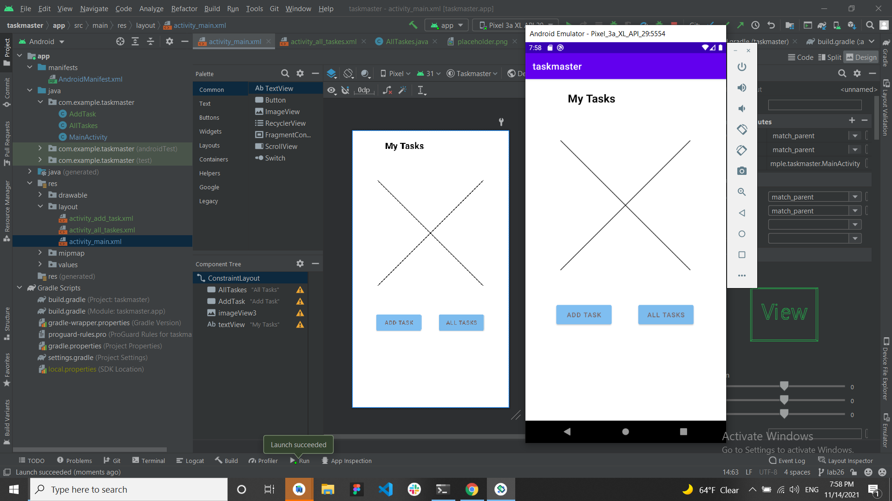
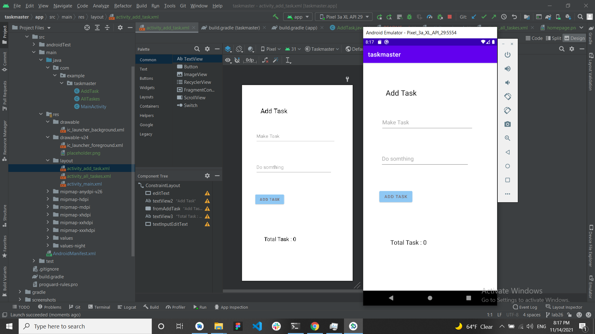
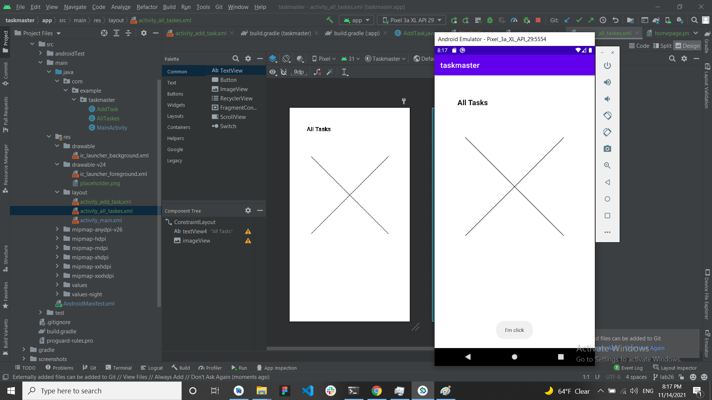
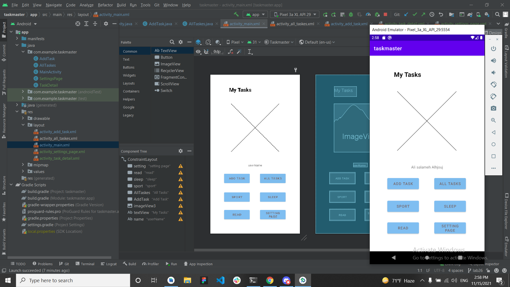
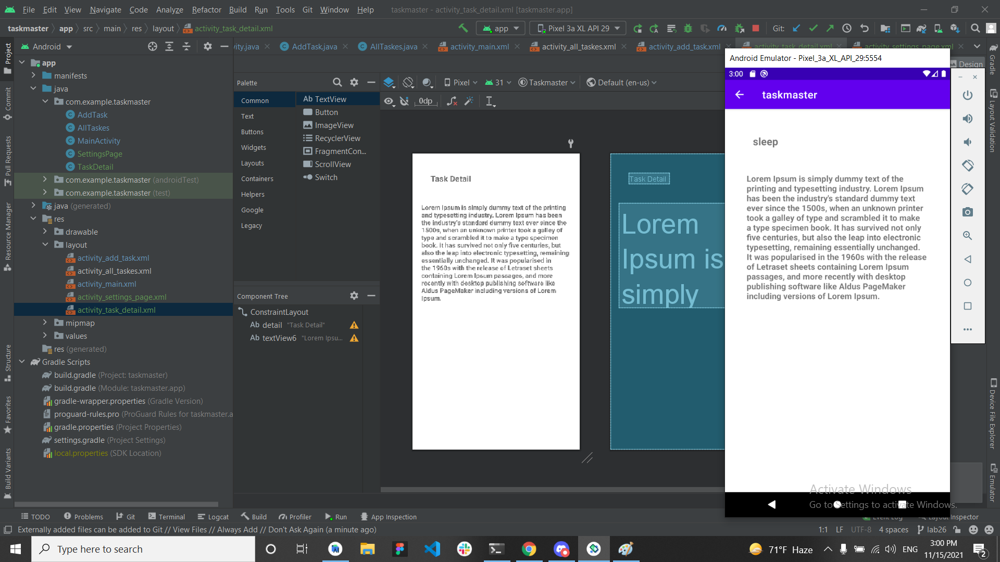
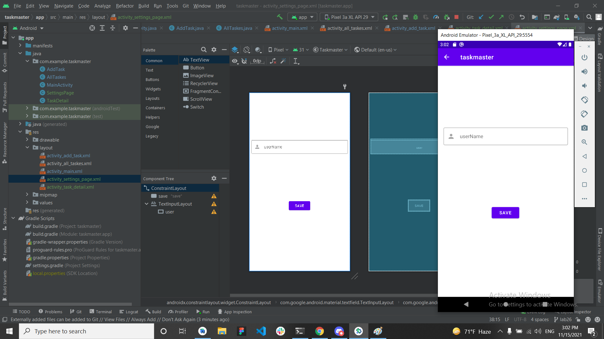
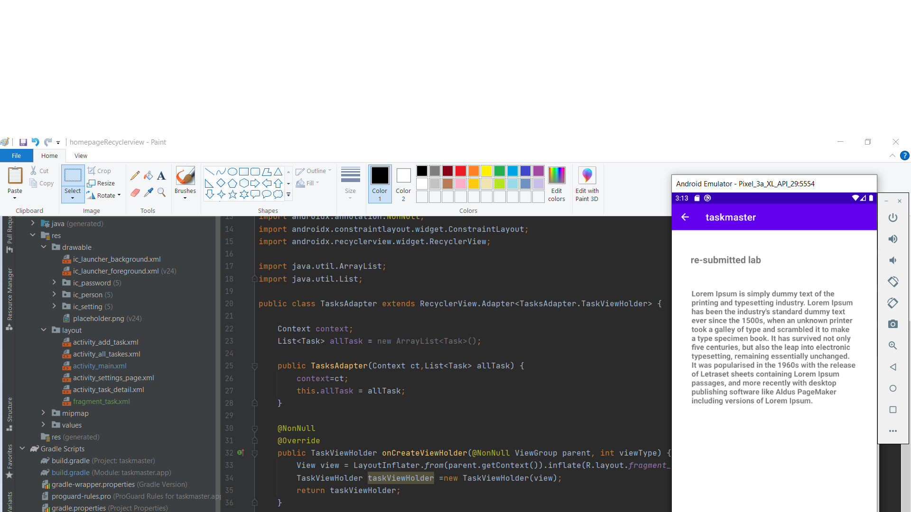

# Task Master

## Feature Tasks

1-Homepage :add an image and two button

2-Add a Task : add to input text layout and button

3-All Tasks : add an image 

## home Page

## Add Task

## All Task

## lab 27

## home page after add three button

## first task

## second task

## Third task

## setting page

## lab 28

## home Page

## detail page

