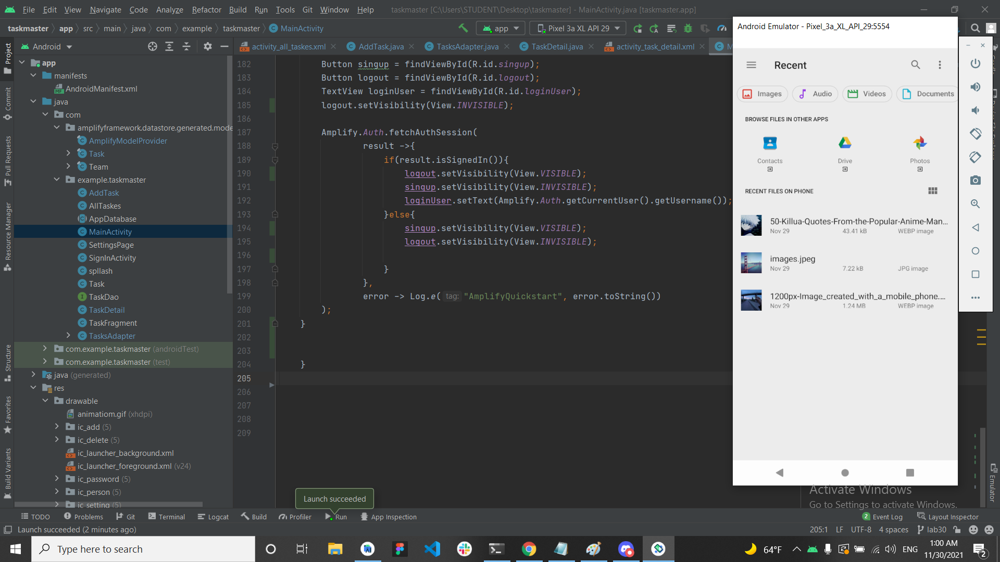

# Task Master

## Feature Tasks

1-Homepage :add an image and two button

2-Add a Task : add to input text layout and button

3-All Tasks : add an image 

## home Page

## Add Task

## All Task

## lab 27

## home page after add three button

## first task

## second task

## Third task

## setting page

## lab 28

## home Page

## detail page

## lab 29

## home Page

## add page

## lab 32

## I change the Room database to aws

# lab 33

* add team to the app
* provide the task in main related to user team

# lab 34

# lab 37

# lab 41 

